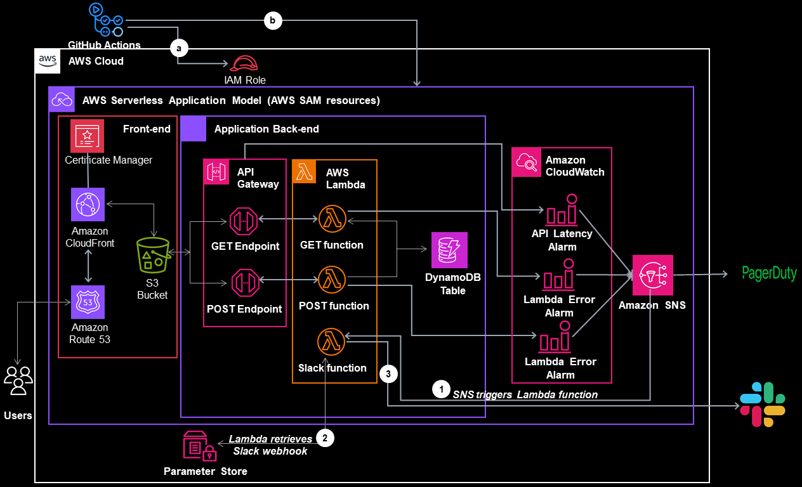
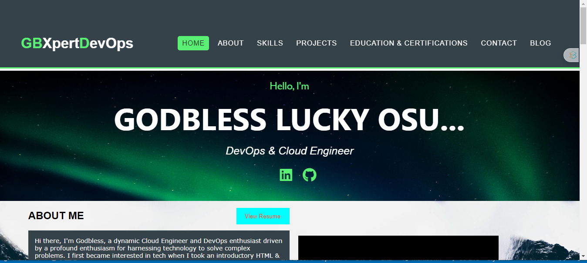
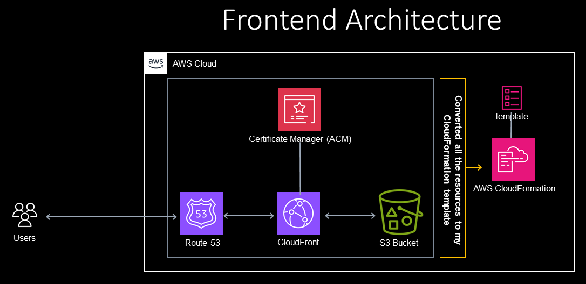
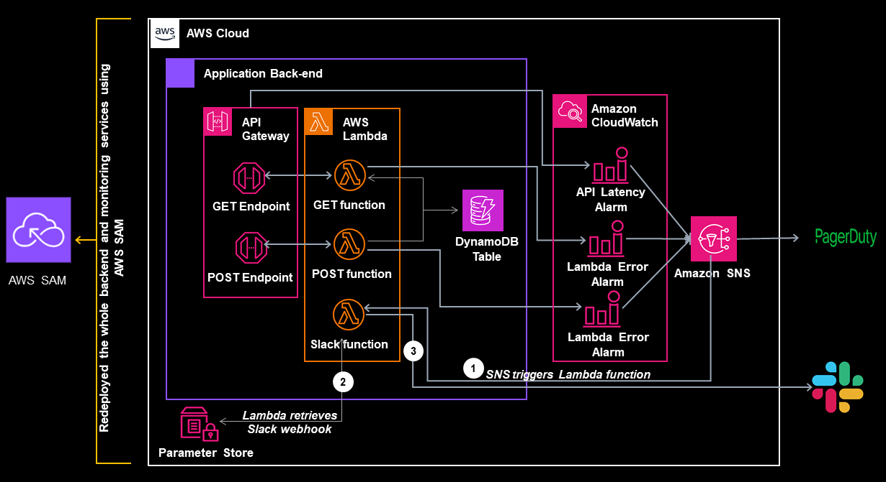
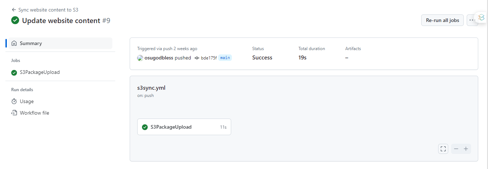
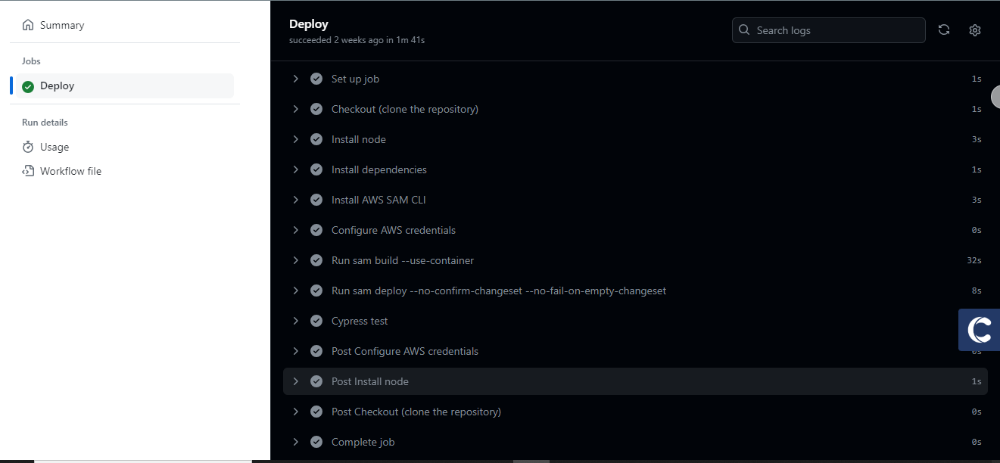

# CONQUERING THE CLOUD RESUME CHALLENGE: MY JOURNEY

As someone coming from a non-IT background wanting to transition into the IT space and looking to build a career specifically as a DevOps Engineer, I enrolled in an AWS Cloud Computing program, while also taking time to learn other fundamental concepts. Upon completing the program, I successfully passed both the AWS Cloud Practitioner and Solutions Architect - Associate exams, earning both certifications.

However, I knew certifications were just not enough. I wanted to dive into real projects where I could roll up my sleeves and actually build something using AWS services. To accomplish this, I started looking out for simple projects that I could begin with, however, a friend recommended the Cloud Resume Challenge (although not beginner-friendly) as a great project to explore (and he wasn't wrong😊😊). So, I had a look at it and saw the challenge as an opportunity to bridge the gap between theory and practical experience with the services it covered. Little did I know the adventure that awaited me...

The cloud resume challenge is actually a challenge by [Forrest Brazeal](https://twitter.com/forrestbrazeal) to help people prepare for a job in the cloud industry. This post therefore is my way of sharing my experience, challenges, and skills gained during my pursuit of the Cloud Resume Challenge.

>You can find my deployed website [here](https://osu-resume.com.ng) to explore the project in action. Also, my [repository](https://github.com/osugodbless/cloud-resume-challenge/tree/main), which stores all the codes and resources.

## The Beginning: How I Decided to Tackle the Challenge

Actually, the Cloud Resume Challenge consists of six(6) chunks of work (chunk 0-5) with each chunk consisting of a couple of steps to complete. I tackled the challenge one chunk at a time. Additionally, there are optional "Mods" sections (Developer, DevOps, and Security). Although optional, I decided to tackle the DevOps Mod alongside each chunk of the main challenge. It was an invaluable opportunity to go above and beyond in my pursuit of excellence, and to also expand my understanding of DevOps. I skipped the first chunk (chunk 0) since I already had the requirement——a Cloud Certification.

## Chunk 1: Building the Frontend

Setting up the resume website's frontend seemed straightforward at first. I utilized HTML/CSS to craft a simple site and stored its contents in an S3 bucket. I wanted to create a CloudFront distribution to serve the content to viewers globally and even though I had done this before, I decided to read further about CloudFront. This is how I discovered that using a [REST API endpoint as the origin](https://repost.aws/knowledge-center/cloudfront-serve-static-website), and restricting access with an [Origin Access Control (OAC)](https://docs.aws.amazon.com/AmazonCloudFront/latest/DeveloperGuide/private-content-restricting-access-to-s3.html) was a more secure way to go about this as opposed to using a website endpoint as the origin (besides, this is AWS's recommended way). You can read about the differences between REST and website API endpoint [here](https://docs.aws.amazon.com/AmazonS3/latest/userguide/WebsiteEndpoints.html#WebsiteRestEndpointDiff). With the above configuration, I made sure that my website was only accessible via CloudFront, not directly from S3.

Further to this, I created an SSL/TLS certificate in ACM, and attached it to the CloudFront distribution. This was to ensure that CloudFront uses secure HTTP (HTTPS) to serve the website.
I then configured Amazon Route53 to route traffic from my existing domain to my CloudFront distribution.

See a screen snip of the website below

### DevOps Way

Lastly, upon verification that [my website](https://osu-resume.com.ng) was working flawlessly, I decided to do things the DevOps way. I converted the S3, Route53, Certificate Manager and CloudFront resources into code using CloudFormation. Then, I set up a GitHub repository and pushed my website codes and CloudFormation template there.

See my architectural diagram for the frontend below.

## Chunk 2 and 3: Tackling the Backend and Testing

As someone with no prior programming experience, Chunk 2 was a tough nut to crack. Most of my time was spent researching, experimenting, and seeking help from online resources and forums (including ChatGPT). I worked with serverless technologies (DynamoDB, Lambda, API Gateway) and built the application using AWS SAM. Everything——from writing the Lambda function using Python, workshopping permissions between Lambda and DynamoDB, to configuring Amazon API Gateway and leveraging JavaScript fetch API to update and retrieve visitor count——felt like a puzzle to solve.

Another significant challenge I faced was navigating CORS errors and authenticating token issues. After days of persistence, I finally solved the  whole puzzle and had all sevices communicating smoothly.

### DevOps Way

To wrap up the chunk 2, I set up monitoring for my backend using CloudWatch, Amazon SNS and Lambda. The approach was simple yet effective: I set up CloudWatch Alarms to monitor certain metrics, have notifications sent to my SNS topic when any Alarm enters an alarm state and finally, SNS topic triggers Lambda which in turn extracts the error message from SNS and sends this message to my slack channel, using the slack credentials stored as a parameter in AWS SSM.

The integration of these tools not only enhanced the resilience of my application but also deepened my understanding of DevOps principles and practices.

See my architectural diagram for the backend below.

### Testing

I embraced Cypress for writing end-to-end API and website testing. Cypress has good documentation, so it was pretty easy to get around it.

Conclusively, Chunk 2 especially was a challenging yet rewarding chapter in my Cloud Resume Challenge journey as it helped me gain invaluable insights into backend development and the concept of serverless.

## Chunk 4: CI/CD and Infrastructure as Code

This phase of the project although not less significant, was easier and faster to accomplish. I guess one of the reasons was because I had automated the creation of all resources using CloudFormation and AWS SAM. I did make an adjustment which was to transfer my CloudFormation resources into my AWS SAM template. This was because I found out that AWS SAM supports the syntax of CloudFormation. So, I didn't see the need for having two different templates plus, it helped simplify the build and deploy process.

I also implemented CI/CD with GitHub Actions. Since I had a single [repository](https://github.com/osugodbless/cloud-resume-challenge/tree/main) for both backend and frontend, I implemented a multi-job workflow with separate YAML files and both are triggered upon any push to the main branch. One YAML file defines a job that synchronizes website contents to the designated S3 bucket and the other defines a job that builds, deploys, and tests the application built with AWS SAM. I used GitHub's OIDC provider to authenticate to AWS and allow my workflow access to the needed resources in my AWS account. This was to follow security best practice of using temporary credentials for AWS access.

You can see in the screen snips of both successful jobs below, that the second job includes a step for configuring AWS credentials.

## Bringing It All Together

The true magic happened when I pulled down all the application resources and redeployed everything just by pushing a change to my repository. I saw all the pieces converged together to form the complete application. I was very thrilled to see the frontend of my website come to life, seamlessly integrated with backend services and automated testing, without having to spend time manually configuring anything again. It made me trully appreciate the power of automation and CI/CD.

See the Complete architecture below

.

## Deployed Website

>You can find my deployed website [here](https://osu-resume.com.ng) to explore the project in action. Also, my [repository](https://github.com/osugodbless/cloud-resume-challenge/tree/main), which stores all the codes and resources.

## Lessons Learned and Growth Achieved

Through the Cloud Resume Challenge, I discovered the benefits of automation, version control, CI/CD, monitoring and observability, iteration, continuous learning, and of course the importance of implementing proper application security measures. Each chunk I took and conquered became an opportunity to grow, whether it was troubleshooting errors, reading documentations, getting familiarized with a new technology, or reiterating on the way I went about solving a particular problem. As a result, I've built some invaluable skills.

## Looking Ahead

After completing the challenge and reflecting on my journey, I realize that the Cloud Resume Challenge is just the beginning. With the newfound skills and confidence I picked, I'm more determined than ever to pursue my goal of becoming an excellent DevOps Engineer. I will be taking time to build my programming skills with Python. In addition, I will be taking on even more projects, starting with a project by [David Thomas](https://linkedin.com/david-thomas-70ba433/) ([Improving application performance using Amazon Elasticache](https://pluralsight.com/resources/blog/cloud/cloudguruchallenge-improve-application-performance-using-amazon-elasticache)). The journey would undoubtedly be challenging, but just like the Cloud Resume Challenge, I know the rewards will also be undoubtedly worth it.

## Final Thoughts

To anyone considering embarking on the Cloud Resume Challenge, my advice is simple: take the leap. As Forrest Brazeal aptly put it, **"It's not a tutorial; it's a project spec."** And what a project it turned out to be! It's a journey of conquering challenges, unlocking new skills, and discovery of the endless possibilties there are in the Cloud.

### Collaboration

If you have some cool project and would like some collaboration to learn and tackle it together, you can reach out to me on [LinkedIn](https://linkedin.com/in/osugodbless/). Let's connect and explore the boundless possiblities of cloud technology, and create innovative solutions together.