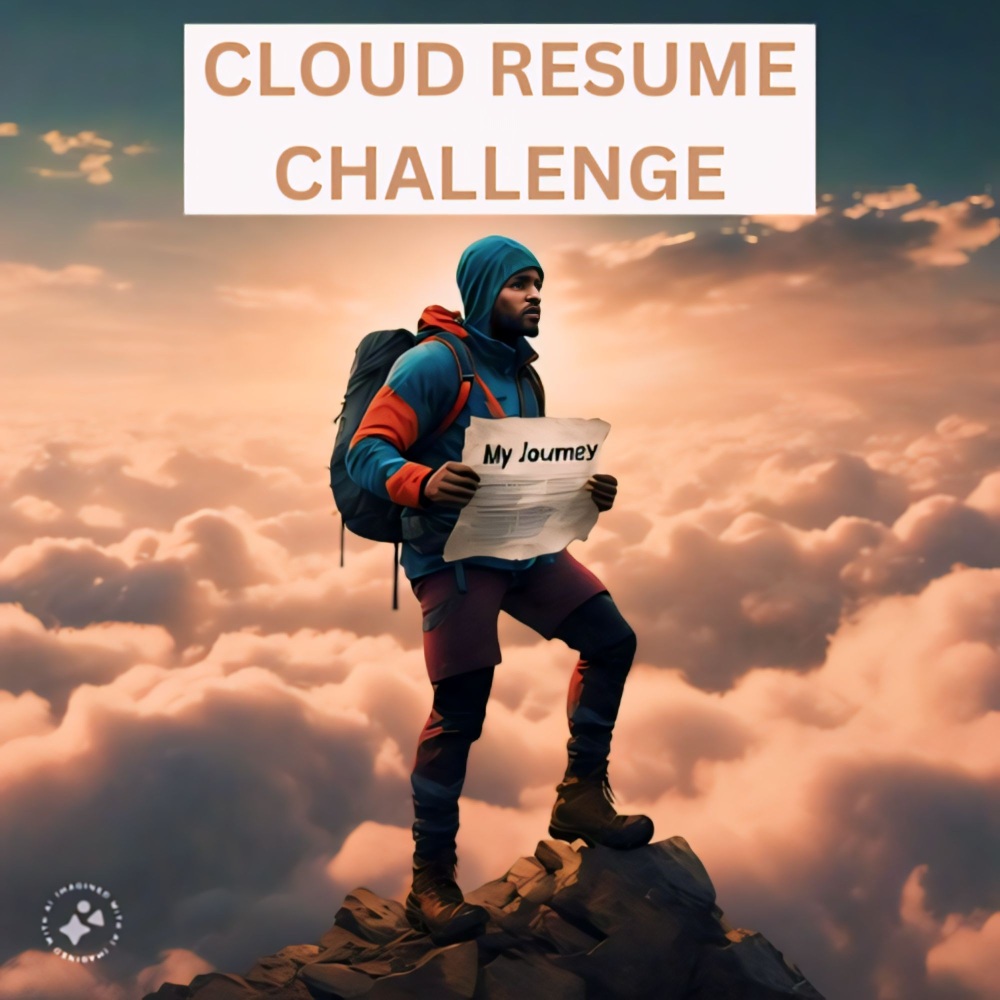

# CONQUERING THE CLOUD RESUME CHALLENGE: MY JOURNEY

As someone coming from a non-IT background wanting to transition into the IT space and looking to build a career specifically as a DevOps Engineer, I enrolled in an AWS Cloud Computing program, while also taking time to learn other fundamental concepts. Upon completing the program, I successfully passed both the AWS Cloud Practitioner and Solutions Architect - Associate exams, earning both certifications. However, I knew certifications were just not enough. I wanted to dive into real projects where I could roll up my sleeves and actually build something using AWS services. To accomplish this, I started looking out for simple projects that I could begin with, however, a friend recommended the Cloud Resume Challenge (although not beginner-friendly) as a great project to explore (and he wasn't wrong😊😊). So, I had a look at it and saw the challenge as an opportunity to bridge the gap between theory and practical experience with the services it covered. Little did I know the adventure that awaited me...

The cloud resume challenge is actually a challenge by [Forrest Brazeal](https://twitter.com/forrestbrazeal) to help people prepare for a job in the cloud industry. This post therefore is my way of sharing my experience, challenges, and skills gained during my pursuit of the Cloud Resume Challenge.

## The Beginning: How I Decided to Tackle the Challenge

Actually, the Cloud Resume Challenge consists of six(6) chunks of work (chunk 0-5) with each chunk consisting of a couple of steps to complete. I tackled the challenge one chunk at a time. Additionally, there are optional "Mods" sections (Developer, DevOps, and Security). Even though optional, I decided to tackle the DevOps Mod alongside each chunk of the main challenge. It was an invaluable opportunity to go above and beyond in my pursuit of excellence, and to also expand my understanding of DevOps. I skipped the first (chunk 0) since I already had the requirement, which was a Cloud Certification.

## Chunk 1: Building the Frontend

Setting up the resume website's frontend seemed straightforward at first. Utilizing HTML/CSS, I crafted a simple site and stored its contents in an S3 bucket. I wanted to create a CloudFront distribution to serve the content to viewers globally and even though I had done this before, I decided to read further about CloudFront. This is how I discovered that using a [REST API endpoint as the origin](https://repost.aws/knowledge-center/cloudfront-serve-static-website), and restricting access with an [Origin Access Control (OAC)](https://docs.aws.amazon.com/AmazonCloudFront/latest/DeveloperGuide/private-content-restricting-access-to-s3.html) was a more secure way to go about this as opposed to using a website endpoint as the origin (besides, this is AWS's recommended way). You can read about the differences between REST and website API endpoint [here](https://docs.aws.amazon.com/AmazonS3/latest/userguide/WebsiteEndpoints.html#WebsiteRestEndpointDiff). With the above configuration, I made sure that my website was only accessible via CloudFront, not directly from S3.

Further to this, I created an SSL/TLS certificate in ACM, and attached it to the CloudFront distribution. This was to ensure that CloudFront uses secure HTTP (HTTPS) to serve the website.
I then configured Amazon Route53 to route traffic from my existing domain to my CloudFront distribution.

Lastly, I verified that [my website](https://osu-resume.com.ng) was working correctly and it was.

See a snapshot of the website below.

## Chunk 2: Tackling the Backend

As someone with no prior programming experience, Chunk 2 presented its own set of challenges. From configuring Amazon API Gateway and Lambda functions to navigating CORS errors, every step felt like a puzzle to solve. Through perseverance and resourcefulness, I overcame these challenges, gaining invaluable insights into backend development along the way.

Chunk 3 and 4: Testing, CI/CD, and Infrastructure as Code

Testing became my ally as I embraced Cypress for API and end-to-end testing. Implementing CI/CD with GitHub Actions streamlined my development process, while Infrastructure as Code (IaC) with AWS SAM ensured consistency and reproducibility in my deployments.

Bringing It All Together

The true magic happened when all the pieces of the puzzle finally converged. Witnessing my website come to life, seamlessly integrated with backend services and automated testing, was nothing short of exhilarating. It was a testament to the power of perseverance and continuous learning.

Lessons Learned and Growth Achieved

Through the Cloud Resume Challenge, I discovered the importance of iteration, security, and teamwork in the world of DevOps. Each hurdle I faced became an opportunity to grow, whether it was troubleshooting errors, mastering new technologies, or refining my approach to problem-solving.

Looking Ahead

As I reflect on my journey, I realize that the Cloud Resume Challenge was just the beginning. Armed with newfound skills and confidence, I'm more determined than ever to pursue my goal of becoming an excellent DevOps Engineer. The journey may have been challenging, but the rewards are undoubtedly worth it.

Final Thoughts

To anyone considering embarking on the Cloud Resume Challenge or a similar endeavor, my advice is simple: take the leap. Embrace the challenges, savor the victories, and never underestimate the power of perseverance. The journey may be daunting, but the lessons learned and the growth achieved are priceless.

As Forrest Brazeal aptly put it, "It's not a tutorial; it's a project spec." And what a project it turned out to be—a journey of conquering challenges, unlocking new skills, and charting a course towards a brighter future in the world of DevOps.

As I reflect on my journey through the Cloud Resume Challenge, I can't help but marvel at how far I've come. What started as a quest to gain hands-on experience with AWS services evolved into a transformative journey of personal growth and discovery in the world of DevOps.